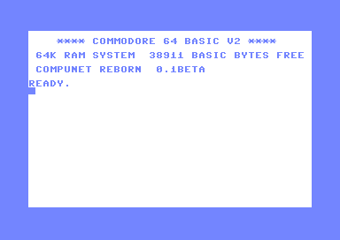

# Compunet Reborn

A recreation of the Compunet online service for the Commodore 64, faithfully preserving the original protocol and user experience over modern TCP/IP.



[Compunet](https://en.wikipedia.org/wiki/Compunet) (also known as CNet) was a UK-based interactive online service that ran from 1984 to May 1993, primarily serving Commodore 64 users. It was operated by Compunet Teleservices Ltd and developed by Ariadne Software. The service featured user-generated content, electronic mail (Courier), telesoftware downloads, a page editor, and a unique horizontally-scrolling menu system known as the "duckshoot".

Users connected via a custom 1200/75 baud modem (the "brick") that plugged into the C64's cartridge port. The modem contained an 8K ROM that bootstrapped the system — the full terminal software was downloaded from the server during each session ("LINKING"), or cached locally via the CNSAVE command.

## Live Service

The official live instance is running at [https://compunet.live/](https://compunet.live/)

## Features

- Directory browsing with full duckshoot menu
- Content viewing (multi-page text frames, PETSCII graphics)
- Telesoftware downloads and uploads
- Electronic mail (Courier) with send/receive and email notifications
- User-generated content (The Jungle) with voting
- Partyline multi-user chat with rooms
- WHO IS ONLINE (live user list)
- WHAT'S NEW (most recent uploads)
- GOTO keyword navigation
- Frame editor (on-line and off-line)
- PETSCII terminal mode (server-rendered, any terminal program)
- 8K cartridge ROM — boots directly like the original hardware

## Connection Methods

| Method | Port | Description |
|--------|------|-------------|
| **C64 Client (CRT)** | 6400 | 8K cartridge — attach and boot. Recommended for VICE / C64 Ultimate. |
| **C64 Client (PRG)** | 6400 | LOAD + RUN. For real hardware with SwiftLink. |
| **PETSCII Terminal** | 6401 | Server-rendered. Works with SyncTerm, CCGMS, StrikeTerm, UltimateTerm. |

## Quick Start

### Option 1: CRT Cartridge (Recommended)

1. Download `compunet-reborn-live.crt` from [compunet.live/connect](https://compunet.live/connect)
2. VICE: File → Attach cartridge image → Reset
3. C64 Ultimate: Select as cartridge → Reset
4. Type `CONNECT` — LINKING downloads terminal software (~3 sec first time)
5. Login with your registered account

### Option 2: PETSCII Terminal

Connect with SyncTerm or any PETSCII terminal:
- Address: `vme.compunet.live:6401`
- Connection Type: Raw
- Screen Mode: C64
- Font: Commodore 64 (LOWER)

### Option 3: PRG (Real Hardware)

1. `LOAD "COMPUNET-REBORN-LIVE",8` then `RUN`
2. Type `CONNECT`
3. LINKING downloads terminal software
4. Login

## Docker Deployment

```bash
cp .env.example .env
# Edit .env with your configuration
docker compose up -d --build
```

This starts:
- **compunet-server** — Protocol server (6400) + PETSCII terminal (6401) + REST API (6403)
- **compunet-web** — Registration website (6464)

See `.env.example` for required configuration variables.

## Building from Source

### Client

```bash
cd client/c64/src
make
```

Produces:
- `compunet-reborn.prg` — Manual connect (LOAD + RUN)
- `compunet-reborn-live.prg` — Auto-connect (LOAD + RUN)
- `compunet-reborn.crt` — 8K cartridge (manual)
- `compunet-reborn-live.crt` — 8K cartridge (auto-connect)
- `compunet-reborn.d64` — D64 with both PRGs
- `terminal.bin` — Terminal binary for server LINKING

Requires: [cc65](https://cc65.github.io/) (ca65/ld65), `c1541` from VICE.

### Server (local, without Docker)

```bash
cd server
python3 -m venv venv
source venv/bin/activate
pip install -r requirements.txt
cd ..
./server.sh start
```

## Architecture

The client is split into two parts, matching the original Compunet design:

- **ROM** (8K, $8000-$9FFF) — Boot code, BASIC extensions (CONNECT, CNLOAD, CNSAVE, EDITOR), ACIA SwiftLink driver, protocol dispatch
- **Terminal** (~7.7K, downloaded to $A000+) — Directory rendering, frame display, duckshoot, mail, uploads, partyline link

On first connect, the server sends the terminal via LINKING (~3 seconds). Users can cache it to disk with `CNSAVE` for instant reconnects. The server tracks a version hash — LINKING is skipped if the cached terminal is current.

## Repository Structure

### Client

- **[client/c64/src/](client/c64/src/)** — Client source (6502 assembly, ca65)
- **[client/c64/src/partyline/](client/c64/src/partyline/)** — Partyline chat client
- **[client/c64/src/gen_sfx.py](client/c64/src/gen_sfx.py)** — PRG builder (BASIC stub + relocator)
- **[client/c64/vintage/](client/c64/vintage/)** — Original reverse engineering artefacts

### Server

- **[server/compunet_server.py](server/compunet_server.py)** — Main server (protocol, LINKING, API, session management)
- **[server/terminal.py](server/terminal.py)** — PETSCII terminal mode (port 6401)
- **[server/partyline.py](server/partyline.py)** — Multi-user partyline chat
- **[server/cfg/](server/cfg/)** — Configuration (users, terminal.bin, templates)
- **[server/data/](server/data/)** — Runtime content (not tracked in git)

### Website

- **[website/](website/)** — Flask web app (registration, admin panel, password reset, guide)

### Documentation

- **[docs/PROTOCOL.md](docs/PROTOCOL.md)** — X.25-derived binary protocol specification
- **[docs/LINKING.md](docs/LINKING.md)** — Terminal download mechanism and CRT architecture
- **[docs/TERMINAL.md](docs/TERMINAL.md)** — PETSCII terminal mode architecture
- **[docs/MODEM.md](docs/MODEM.md)** — Hardware comparison and ACIA driver approach
- **[docs/partyline.md](docs/partyline.md)** — Partyline chat system design

### Historical

- **[historical/](historical/)** — Original SEQ files, D64 disk images, documentation

## Acknowledgements

Thanks to Charles Headey for providing the cnboot.prg and cnet.prg files.

Historical SEQ file sources:
- **4Rich** — Graeme Norgate (PIMAN)
- **compunet-pages-interviews** — Frank @ Games That Weren't
- **compunet-sequence-files** — Unknown
- **neil_shumsky** — Neil Shumsky (256 SEQ files extracted from D64 disk images)

Thanks to Mark Wilson for providing the Welcome screen, music, and other historical frames.

Thanks to Richard Hawkins (RH18 FROODLE) for helping source some of these files.

## Links

- [Compunet on Wikipedia](https://en.wikipedia.org/wiki/Compunet)
- [C64 Apocalypse - Compunet pages](http://www.64apocalypse.com/compunet/compunet.htm)
