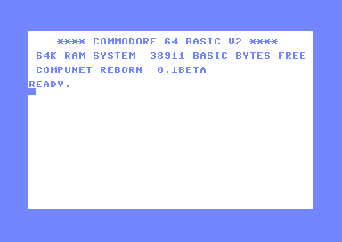

# Compunet Reborn

A recreation of the Compunet online service for the Commodore 64, faithfully preserving the original protocol and user experience over modern TCP/IP.



[Compunet](https://en.wikipedia.org/wiki/Compunet) (also known as CNet) was a UK-based interactive online service that ran from 1984 to May 1993, primarily serving Commodore 64 users. It was operated by Compunet Teleservices Ltd and developed by Ariadne Software. The service featured user-generated content, electronic mail (Courier), telesoftware downloads, a page editor, and a unique horizontally-scrolling menu system known as the "duckshoot".

Users connected via a custom 1200/75 baud modem (the "brick") that plugged into the C64's cartridge port. The modem contained an 8K ROM that bootstrapped the system — the full terminal software was downloaded from the server during each session ("LINKING"), or cached locally via the CNSAVE command.

Compunet also shipped a native **Amiga** client in 1989. That original binary has been recovered and reverse-engineered, reconstructed as recompilable C (vbcc), and re-pointed from its modem/`cnet.device` transport to native TCP/IP — so a real or emulated Amiga running Kickstart 2.04 or later can connect to Compunet Reborn today. See [Connection Methods](#connection-methods) and [docs/amiga-client.md](docs/amiga-client.md).

## Live Service

The official live instance is running at [https://compunet.live/](https://compunet.live/)

## Features

- Directory browsing with full duckshoot menu
- Content viewing (multi-page text frames, PETSCII graphics)
- Telesoftware downloads and uploads
- Electronic mail (Courier) with send/receive and email notifications
- User-generated content (The Jungle) with voting
- Custom PETSCII headers on directories you own, uploaded from the website
- Partyline multi-user chat with rooms
- WHO IS ONLINE (live user list)
- WHAT'S NEW (most recent uploads)
- GOTO keyword navigation
- Frame editor (on-line and off-line), whose buffer survives closing the client
- PETSCII terminal mode (server-rendered, any terminal program)
- 8K cartridge ROM — boots directly like the original hardware
- Native Amiga client — the recovered 1989 Amiga client, reconstructed over TCP/IP
- Modern client in a browser or as a desktop app — same codebase, same behaviour
- Optional 1200 baud mode: pages paint as they arrive, at the original's speed

## Connection Methods

| Method | Port | Description |
|--------|------|-------------|
| **C64 Client (CRT)** | 6400 | 8K cartridge — attach and boot. Recommended for VICE / C64 Ultimate. |
| **C64 Client (PRG)** | 6400 | LOAD + RUN. For real hardware with SwiftLink. |
| **Amiga Client** | 6400 | Native Amiga client (LHA download). Needs a bsdsocket TCP/IP stack, so Kickstart 2.04+. |
| **PETSCII Terminal** | 6401 | Server-rendered. Works with SyncTerm, CCGMS, StrikeTerm, UltimateTerm. |
| **Web / Desktop client** | 6404 | Modern client over the JSON API (Binding B). Runs in a browser or as an Electron desktop app. |

## Quick Start

### Option 1: Browser (Quickest)

1. Go to [connect.compunet.live](https://connect.compunet.live)
2. Log in with your registered account

Nothing to download, no emulator, no configuration. The same client is also available as a
Windows desktop app — an installer, or a portable build that keeps its settings and your editor
pages beside the executable.

### Option 2: CRT Cartridge (the real thing)

1. Download `compunet-reborn-live.crt` from [compunet.live/connect](https://compunet.live/connect)
2. VICE: File → Attach cartridge image → Reset
3. C64 Ultimate: Select as cartridge → Reset
4. Type `CONNECT` — LINKING downloads terminal software (~3 sec first time)
5. Login with your registered account

### Option 3: PETSCII Terminal

Connect with SyncTerm or any PETSCII terminal:
- Address: `vme.compunet.live:6401`
- Connection Type: Raw
- Screen Mode: C64
- Font: Commodore 64 (LOWER)

### Option 4: PRG (Real Hardware)

1. `LOAD "COMPUNET-REBORN-LIVE",8` then `RUN`
2. Type `CONNECT`
3. LINKING downloads terminal software
4. Login

### Option 5: Amiga

1. Download `compunet-reborn-amiga.lha` from [compunet.live/connect](https://compunet.live/connect)
2. Un-archive it (`lha x compunet-reborn-amiga.lha`) — you get a **Compunet** drawer
3. Make sure a bsdsocket TCP/IP stack (Roadshow, AmiTCP, Miami…) is installed and online
4. Double-click the **Compunet** icon (or run it from a Shell)
5. Login with your registered account

The client itself runs on **Kickstart 1.3** or later — it is built against the 1.3 NDK, as the
1989 original was, and without a TCP/IP stack it simply keeps its offline UI. To go online you
need a **bsdsocket TCP/IP stack** (Roadshow, AmiTCP, Miami), and those require **Kickstart 2.04 or
later** — that, not the client, is what sets the floor.

The bundled `TCPHOST` file is preset to `vme.compunet.live:6400` — edit it only to point at a
different server.

## Docker Deployment

```bash
cp .env.example .env
# Edit .env with your configuration
docker compose up -d --build
```

This starts:
- **compunet-server** — Protocol server (6400) + PETSCII terminal (6401) + REST API (6403) +
  client API (6404). The client API also **serves the web client itself**, so one hostname
  pointed at 6404 gives a working client with nothing for the user to configure.
- **compunet-web** — Registration website (6464)

Set `COMPUNET_CLIENT_URL` on **compunet-web** to the address your client API is published at
(e.g. `https://connect.example.com`) and the website links through to it. Leave it unset and the
site simply omits the link — which is correct for a deployment that does not host a client.

⚠ The **REST API on 6403 is for the website only** and reaches it over the internal network.
It does not need publishing, and should not be exposed.

See `.env.example` for required configuration variables.

## Building from Source

> **Toolchains and known pitfalls: [REQUIREMENTS.md](REQUIREMENTS.md)** — one page covering what
> each component needs, a command to check it is there, and the platform traps (Windows line
> endings and the C64 version hash, electron-builder's symlink failure, the file lock that hangs
> packaging).

### Client

```bash
cd client/c64/src
make
```

Produces:
- `compunet-reborn.prg` — Manual connect (LOAD + RUN)
- `compunet-reborn-live.prg` — Auto-connect (LOAD + RUN)
- `compunet-reborn.crt` — 8K cartridge (manual)
- `compunet-reborn-live.crt` — 8K cartridge (auto-connect)
- `compunet-reborn.d64` — D64 with both PRGs
- `terminal.bin` — Terminal binary for server LINKING

Requires: [cc65](https://cc65.github.io/) (ca65/ld65), `c1541` from VICE.

### Amiga Client

```bash
cd client/amiga/emulation
VBCC=/path/to/vbcc ./make_hdd.sh
```

Compiles the reconstructed client (`client/amiga/src/`) with vbcc, stages a mountable Directory-HD under `hdd/` for emulator testing, and builds the distribution LHA archives into `client/amiga/dist/` (public + `-dev`) plus the Aminet `.readme` — via `make_lha.py`.

Requires: [vbcc](http://sun.hasenbraten.de/vbcc/) (m68k-amigaos) + vasm, and `xdftool` from [amitools](https://github.com/cnvogelg/amitools) for the ADF/icon steps. See [docs/amiga-client.md](docs/amiga-client.md) for the reverse-engineering and reconstruction details.

### Web / desktop client

```bash
cd client/web && npm install && npm run build      # the client itself
cd ../electron && npm install && npm start         # run it as a desktop app
```

`client/web` builds `dist/app.bundle.js`, which is what both the browser and the desktop app
run — one codebase, two wrappers. To package the desktop app:

```bash
cd client/electron
npm run dist:win     # win-unpacked + installer + portable exe
npm run dist:mac     # dmg — must be run ON macOS
```

Use `dist:win` after any client change. There is also a `pack:win` that writes only
`dist/win-unpacked/`, but it leaves the installer and the portable exe at the previous build —
and those are what people reach for, so a "quick" package is how someone ends up testing old
code.

Every script rebuilds the web client first, so a package can never ship a stale bundle. See
[client/electron/README.md](client/electron/README.md) for the artifacts and the platform notes.

Requires: Node.js.

### Server (local, without Docker)

```bash
cd server
python3 -m venv venv
source venv/bin/activate
pip install -r requirements.txt
cd ..
./server.sh start
```

To run the client API and serve the web client together for development — the same pairing a
deployment gets on one hostname:

```bash
python server/run_api_dev.py      # client + API on http://localhost:6404
```

## Architecture

The client is split into two parts, matching the original Compunet design:

- **ROM** (8K, $8000-$9FFF) — Boot code, BASIC extensions (CONNECT, CNLOAD, CNSAVE, EDITOR), ACIA SwiftLink driver, protocol dispatch
- **Terminal** (~7.7K, downloaded to $A000+) — Directory rendering, frame display, duckshoot, mail, uploads, partyline link

On first connect, the server sends the terminal via LINKING (~3 seconds). Users can cache it to disk with `CNSAVE` for instant reconnects. The server tracks a version hash — LINKING is skipped if the cached terminal is current.

### One service, two transports

Compunet Reborn is **one application model** reached over **two transport bindings**. The model
— directories, frames, mail, uploads, the editor, Partyline — is identical across both; only the
encoding differs, and neither binding can do anything the other cannot express.

| | **Binding A** | **Binding B** |
|---|---|---|
| Port | 6400 | 6404 |
| Encoding | X.25-over-TCP framing + PETSCII | JSON over WebSocket + REST |
| Clients | C64 (CRT/PRG), Amiga | web, Electron desktop |
| Status | **frozen** — the ROM cannot be changed | evolving |

Binding B is implemented as a *serializer over the same core*, driving the same authoritative
command handling and serializing the resulting state, rather than as a parallel implementation.
Frames arrive as a rendered 40×24 cell grid, so a modern client never parses PETSCII.
See [docs/spec/api/](docs/spec/api/README.md).

## Repository Structure

### Client

- **[client/c64/src/](client/c64/src/)** — C64 client source (6502 assembly, ca65)
- **[client/c64/src/partyline/](client/c64/src/partyline/)** — Partyline chat client
- **[client/c64/src/gen_sfx.py](client/c64/src/gen_sfx.py)** — PRG builder (BASIC stub + relocator)
- **[client/c64/vintage/](client/c64/vintage/)** — Original C64 reverse engineering artefacts
- **[client/amiga/src/](client/amiga/src/)** — Reconstructed native Amiga client (C, vbcc)
- **[client/amiga/emulation/](client/amiga/emulation/)** — Amiga build + packaging (`make_hdd.sh`, `make_lha.py`, Directory-HD, LHA)
- **[client/amiga/vintage/](client/amiga/vintage/)** — Recovered original Amiga binaries + RE tooling
- **[client/web/](client/web/)** — Reference web client for the JSON API (TypeScript, canvas-rendered 40×24 screen, duckshoot, frame editor)
- **[client/electron/](client/electron/)** — Electron desktop shell around the web client (Windows/Mac/Linux)

### Server

- **[server/compunet_server.py](server/compunet_server.py)** — Main server (protocol, LINKING, API, session management)
- **[server/api_binding.py](server/api_binding.py)** — Client API, Binding B (JSON over WebSocket + REST, port 6404)
- **[server/terminal.py](server/terminal.py)** — PETSCII terminal mode (port 6401)
- **[server/partyline.py](server/partyline.py)** — Multi-user partyline chat
- **[server/cfg/](server/cfg/)** — Configuration (users, terminal.bin, templates)
- **[server/data/](server/data/)** — Runtime content (not tracked in git; `content.test/` is,
  as the fixture tree the tests run against)
- **[server/tests/](server/tests/README.md)** — Regression tests: Binding B against the fixture
  tree, and the reference client's command set against the specification. Stdlib `unittest`,
  no dependencies

```bash
python server/tests/test_api_binding.py && python server/tests/test_client_conformance.py
```

### Website

- **[website/](website/)** — Flask web app (registration, admin panel, password reset, guide,
  news). News items are Markdown files in [website/news/](website/news/), named
  `YYYY-MM-DD-slug.md`; the filename gives the date and the permalink, the first `#` heading
  gives the title. Adding one means adding a file and deploying — the site has no write path to
  its own content, by design

### Documentation

**The specification** — the single source of truth for building a client:

- **[docs/spec/](docs/spec/README.md)** — Compunet Client Specification: a normative,
  platform-agnostic guide to building a client over TCP (transport, session, commands,
  PETSCII display, frame & directory formats, subsystems, and appendices with the font,
  palette, and the embedded directory/HELP/editor-help/COURIER frames). Start here.
- **[docs/spec/api/](docs/spec/api/README.md)** — the **Binding B** JSON API, and the design
  rationale behind adding a second binding rather than a second implementation.
- **[docs/spec/CONFORMANCE.md](docs/spec/CONFORMANCE.md)** — a self-audit to run against a
  finished client: does it do what Compunet did, or merely work?

**Platform notes & provenance** (non-normative — the spec is authoritative):

- **[docs/PROTOCOL.md](docs/PROTOCOL.md)** — original C64 ROM reference and RE provenance (superseded as protocol authority by the spec)
- **[docs/TERMINAL.md](docs/TERMINAL.md)** — the separate server-rendered PETSCII terminal product (port 6401)
- **[docs/MODEM.md](docs/MODEM.md)** — C64 hardware layer (ACIA driver)
- **[docs/ROM-REWRITE.md](docs/ROM-REWRITE.md)** — C64 ROM/PRG build structure
- **[docs/partyline.md](docs/partyline.md)** — Partyline UX design + C64/Amiga platform mechanics
- **[docs/amiga-client.md](docs/amiga-client.md)** — recovered Amiga client analysis / reconstruction record
- **[docs/amiga-modern-ux.md](docs/amiga-modern-ux.md)** — Modern-UX proposal for the Amiga client
- **[docs/historical/](docs/historical/)** — Retired investigation notes and completed implementation plans

### Historical

- **[historical/](historical/)** — Original SEQ files, D64 disk images, documentation
- **[historical/original-keywords.txt](historical/original-keywords.txt)** — the original
  service's own `INDEX` page, transcribed: 160 GOTO keywords with the operators' own
  descriptions, as the live system listed them c.1987

## Acknowledgements

Thanks to Charles Headey for providing the cnboot.prg and cnet.prg files.

Historical SEQ file sources:
- **4Rich** — Graeme Norgate (PIMAN)
- **compunet-pages-interviews** — Frank @ Games That Weren't
- **compunet-sequence-files** — Unknown
- **neil_shumsky** — Neil Shumsky (256 SEQ files extracted from D64 disk images)
- **zildac** — ZILDAC (43 SEQ files extracted from 35 Compunet demo D64 disk images,
  including the service's own `INDEX` page, transcribed to
  [historical/original-keywords.txt](historical/original-keywords.txt))

Thanks to Mark Wilson (MW20) for finding the original 1989 **Amiga client** — on 17-Bit
Software's "Comms Disc III", after it had failed to turn up on Aminet, in forum threads or
anywhere else and was assumed lost — and for providing the Welcome screen, music, and other
historical frames.

Thanks to Richard Hawkins (RH18 FROODLE) for helping source some of these files.

## Links

- [Compunet on Wikipedia](https://en.wikipedia.org/wiki/Compunet)
- [C64 Apocalypse - Compunet pages](http://www.64apocalypse.com/compunet/compunet.htm)
